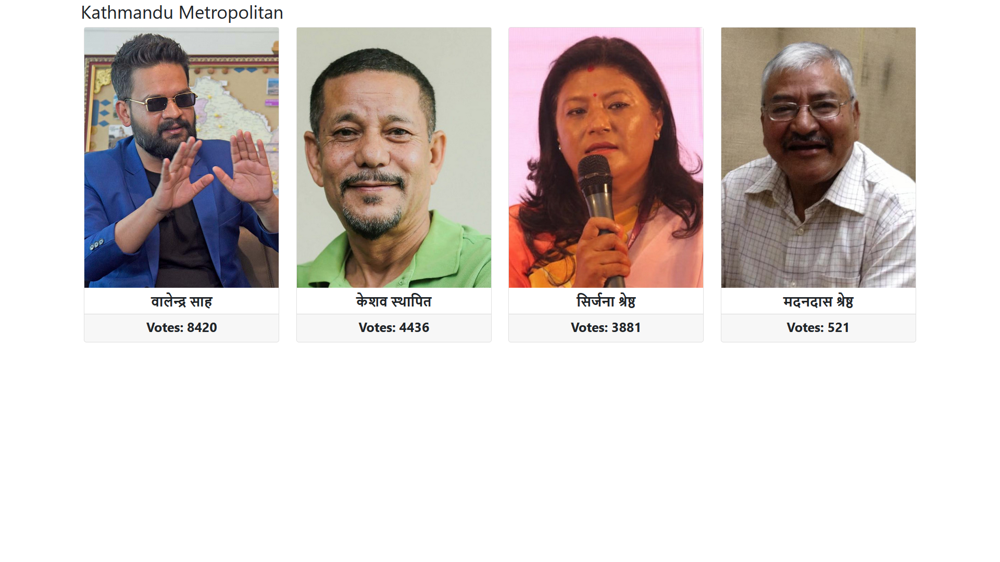

## 2079 Election Live/API
Scraps election data from Kantipur.

<p align='center'>
	
</p>

## Getting Started
- Clone the project
```git clone https://github.com/dioveath/election-2079-live```
- Install all the packages. 
```npm install ```
- Start the server
```node index.js```
- Open ```http://localhost:5000```

### API
```http://localhost:5000/api/v1/kathmandu```

